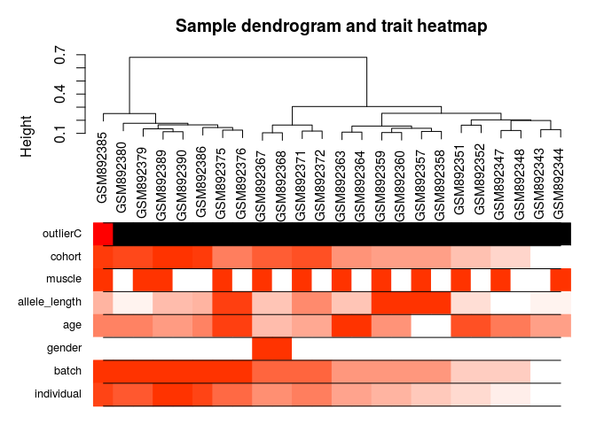
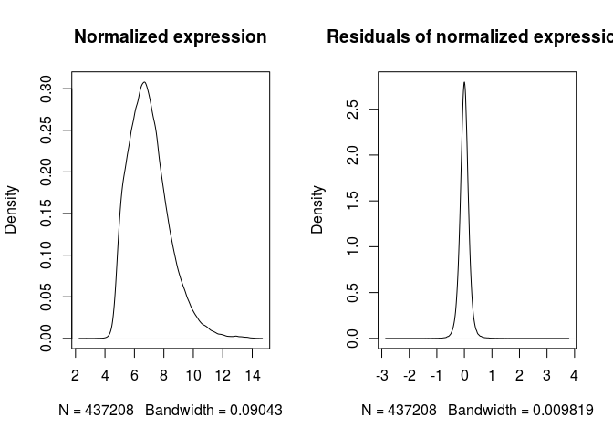

1.  Preprocessing of expression data
================

``` r
suppressPackageStartupMessages ({   
  library (knitr)
  library (GEOquery)
  library (dplyr)
  library (tibble)
  library (biomaRt) 
  library (data.table)
  library (WGCNA)   
  library (flashClust)  
})
opts_knit$set (root.dir = rprojroot::find_rstudio_root_file())
opts_chunk$set (eval = TRUE, tidy = TRUE, highlight = TRUE, fig.path = "../Figures/")
BiocStyle::markdown ()
```

Loading expression and phenotypic data
--------------------------------------

``` r
# Download data from GEO:
if (file.exists("Outputs/GSE36398.RData")) {
    load("Outputs/GSE36398.RData")
} else {
    gset <- getGEO("GSE36398", GSEMatrix = TRUE, getGPL = FALSE, AnnotGPL = TRUE)[[1]]
    # Phenotypic data
    phen <- as(phenoData(gset), "data.frame")
    phen <- phen %>% dplyr::select(grep("characteristics", names(phen))) %>% rownames_to_column("sampID") %>% 
        rename(subject = characteristics_ch1) %>% mutate(subject = gsub("subject: ", 
        "", as.character(subject))) %>% rename(cohort = characteristics_ch1.1) %>% 
        mutate(cohort = gsub("cohort: ", "", as.character(cohort))) %>% rename(muscle = characteristics_ch1.2) %>% 
        mutate(muscle = gsub("tissue: ", "", as.character(muscle))) %>% rename(status = characteristics_ch1.3) %>% 
        mutate(status = gsub("disease state: ", "", as.character(status))) %>% rename(allele_length = characteristics_ch1.4) %>% 
        mutate(allele_length = gsub("ecori/blni allele length: ", "", as.character(allele_length))) %>% 
        rename(age = characteristics_ch1.5) %>% mutate(age = gsub("[^0-9]", "", as.character(age))) %>% 
        rename(gender = characteristics_ch1.6) %>% mutate(gender = gsub("Sex: ", 
        "", as.character(gender))) %>% rename(batch = characteristics_ch1.7) %>% 
        mutate(batch = gsub("batch: Batch_", "", as.character(batch))) %>% filter(status == 
        "control") %>% mutate(individual = match(subject, unique(subject)))
    rownames(phen) <- phen$sampID
    save(gset, phen, file = "Outputs/GSE36398.RData")
}

# Annotating Probes Downloading probe IDs form Ensembl
if (file.exists("Outputs/EnsemblAnnotations.RData")) {
    load("Outputs/EnsemblAnnotations.RData")
} else {
    human <- useMart("ensembl", dataset = "hsapiens_gene_ensembl", host = "http://apr2018.archive.ensembl.org")
    annot_ens <- getBM(attributes = c("ensembl_transcript_id", "external_gene_name", 
        "affy_hugene_1_0_st_v1"), mart = human)
    annot_ens <- unique(annot_ens[!is.na(annot_ens$affy_hugene_1_0_st_v1), ])
    # Finding probes annoatated to multiple genes
    annot_ens <- aggregate(annot_ens[-c(3)], by = list(annot_ens[, 3]), c)
    colnames(annot_ens)[1] <- "ID"
    annot_ens$NoGenes <- sapply(annot_ens$external_gene_name, function(x) length(unique(x)))
    
    x <- annot_ens$ensembl_transcript_id
    y <- character(length(x))
    for (i in 1:length(x)) y[i] <- paste0(unique(x[[i]]), collapse = ", ")
    annot_ens$ensembl_transcript_id <- y
    x <- annot_ens$external_gene_name
    y <- character(length(x))
    for (i in 1:length(x)) y[i] <- paste0(unique(x[[i]]), collapse = ", ")
    annot_ens$external_gene_name <- y
    # Removing probes annotated to multiple genes
    annot_ens <- annot_ens[annot_ens$NoGenes == 1, c(1, 3)]
    # Importing affimetrix file to remove control probes
    annot_afy <- unique(data.frame(fread("Resources/HuGene-1_0-st-v1.na36.hg19.probeset.csv"))[, 
        c(7, 39)])
    table(annot_afy$probeset_type)  #Probe types\t
    # control->affx control->bgp->antigenomic FLmRNA->unmapped main normgene->exon
    # normgene->intron 57 45 227 28869 1195 2904 Subsetting main probes
    annot_ens <- merge(annot_ens, annot_afy, by.x = "ID", by.y = "transcript_cluster_id", 
        all = T)
    annot_ens <- na.omit(annot_ens[annot_ens$probeset_type == "main", -3])
    save(annot_ens, phen, file = "Outputs/EnsemblAnnotations.RData")
}

# Expression data
dataset <- exprs(gset)
dataset <- unique(dataset[rownames(dataset) %in% annot_ens$ID, ])
rownames(dataset) <- annot_ens$external_gene_name[match(rownames(dataset), annot_ens$ID)]

# Multiple probes that assigned to the same genes were considered separately in
# all analyses
rownames(dataset) <- make.unique(rownames(dataset), sep = "___")
# Genes whose expression values were below the first quantile were filtered out
dataset <- as.matrix(as.data.frame(t(dataset)))
datasetFilt <- dataset[, colMeans(dataset) > quantile(density(dataset)$x, 0.25)]
# Subsetting the healthy individuals
datasetFilt_control <- datasetFilt[rownames(datasetFilt) %in% phen$sampID[phen$status == 
    "control"], ]
phenWGCNA <- phen %>% mutate(allele_length = as.numeric(gsub("[^0-9]", "", allele_length))) %>% 
    mutate(muscle = ifelse(muscle == "Deltoid", 0, 1)) %>% mutate(gender = ifelse(gender == 
    "F", 0, 1))
phenWGCNA <- phenWGCNA[vapply(phenWGCNA, function(x) length(unique(x)) > 1, logical(1L))]
rownames(phenWGCNA) <- phenWGCNA$sampID
```

Removing the outlier samples
----------------------------

``` r
# show that row names agree
all(rownames(phenWGCNA) == rownames(datasetFilt_control))
```

    ## [1] TRUE

``` r
# sample network based on squared Euclidean distance note that data should be
# transposed
A <- adjacency(t(datasetFilt_control), type = "distance")
# this calculates the whole network connectivity
k <- as.numeric(apply(A, 2, sum)) - 1
# standardized connectivity
Z.k <- scale(k)
# Designate samples as outlying if their Z.k value is below the threshold
thresholdZ.k <- -2.5  # often -2.5\t
# the color vector indicates outlyingness (red)
outlierColor <- ifelse(Z.k < thresholdZ.k, "red", "black")

# calculate the cluster tree using flahsClust or hclust
sampleTree <- flashClust(as.dist(1 - A), method = "average")
# Convert traits to a color representation where red indicates high values
traitColors <- data.frame(numbers2colors(sapply(phenWGCNA[-c(1:2)], as.numeric), 
    signed = FALSE))
dimnames(traitColors)[[2]] <- names(phenWGCNA)[-c(1:2)]
datColors <- data.frame(outlierC = outlierColor, traitColors)
# Plot the sample dendrogram and the colors underneath.
plotDendroAndColors(sampleTree, groupLabels = names(datColors), colors = datColors, 
    main = "Sample dendrogram and trait heatmap")
```



``` r
# Remove outlying samples from expression and phenotypic data Considering
# standardized sample connectivity
remove.samples <- Z.k < thresholdZ.k | is.na(Z.k)
remove.individual <- phenWGCNA[remove.samples, ]$individual
remove.samples <- phenWGCNA[phenWGCNA$individual == remove.individual, ]$sampID

# Considering the age
remove.samples <- c(remove.samples, phenWGCNA$sampID[phenWGCNA$age < 25])
```

#### Removing the batch effect using linear models (input for WGCNA)

``` r
design <- model.matrix(~0 + factor(phenWGCNA$batch), phenWGCNA)
colnames(design) <- gsub(".*)", "batch", colnames(design))
# Linear model to remove batch effects in filtered data
fit <- lm(datasetFilt_control ~ design)
resid_datasetFilt_control <- residuals(fit, type = "deviance")
par(mfcol = c(1, 2))
plot(density(datasetFilt_control), main = "Normalized expression")
plot(density(resid_datasetFilt_control), main = "Residuals of normalized expression")
```



### Saving files for DEA and WGCNA

``` r
# DEA input files
phen <- phen[phen$sampID != remove.samples, ]
datasetFilt_control <- datasetFilt_control[rownames(datasetFilt_control) != remove.samples, 
    ]
save(datasetFilt_control, phen, file = "Outputs/HealthyMusclesDataforDEA.RData")
# WGCNA input files
phenWGCNA <- phenWGCNA[phenWGCNA$sampID != remove.samples, ]
resid_datasetFilt_control <- resid_datasetFilt_control[rownames(resid_datasetFilt_control) != 
    remove.samples, ]
save(phenWGCNA, resid_datasetFilt_control, file = "Outputs/HealthyMusclesDataforWGCNA.RData")
```

``` r
sessionInfo()
```

    ## R version 3.2.3 (2015-12-10)
    ## Platform: x86_64-pc-linux-gnu (64-bit)
    ## Running under: Ubuntu 16.04.5 LTS
    ## 
    ## locale:
    ##  [1] LC_CTYPE=en_US.UTF-8       LC_NUMERIC=C              
    ##  [3] LC_TIME=en_US.UTF-8        LC_COLLATE=en_US.UTF-8    
    ##  [5] LC_MONETARY=en_US.UTF-8    LC_MESSAGES=en_US.UTF-8   
    ##  [7] LC_PAPER=en_US.UTF-8       LC_NAME=C                 
    ##  [9] LC_ADDRESS=C               LC_TELEPHONE=C            
    ## [11] LC_MEASUREMENT=en_US.UTF-8 LC_IDENTIFICATION=C       
    ## 
    ## attached base packages:
    ## [1] parallel  stats     graphics  grDevices utils     datasets  methods  
    ## [8] base     
    ## 
    ## other attached packages:
    ##  [1] BiocStyle_1.8.0       flashClust_1.01-2     WGCNA_1.68           
    ##  [4] RSQLite_2.1.4         fastcluster_1.1.25    dynamicTreeCut_1.63-1
    ##  [7] data.table_1.12.8     biomaRt_2.37.4        tibble_2.1.3         
    ## [10] dplyr_0.8.3           GEOquery_2.36.0       Biobase_2.30.0       
    ## [13] BiocGenerics_0.16.1   knitr_1.27           
    ## 
    ## loaded via a namespace (and not attached):
    ##  [1] bitops_1.0-6          matrixStats_0.55.0    robust_0.4-18.1      
    ##  [4] fit.models_0.5-14     bit64_0.9-7           doParallel_1.0.15    
    ##  [7] RColorBrewer_1.1-2    progress_1.2.2        httr_1.4.1           
    ## [10] rprojroot_1.3-2       tools_3.2.3           backports_1.1.5      
    ## [13] R6_2.4.1              rpart_4.1-15          Hmisc_4.3-0          
    ## [16] DBI_1.0.0             lazyeval_0.2.2        colorspace_1.4-1     
    ## [19] nnet_7.3-12           tidyselect_0.2.5      gridExtra_2.3        
    ## [22] prettyunits_1.0.2     bit_1.1-14            preprocessCore_1.32.0
    ## [25] formatR_1.7           htmlTable_1.13.3      scales_1.1.0         
    ## [28] checkmate_1.9.4       DEoptimR_1.0-8        mvtnorm_1.0-8        
    ## [31] robustbase_0.93-5     stringr_1.4.0         digest_0.6.23        
    ## [34] foreign_0.8-72        rmarkdown_2.0.7       rrcov_1.4-9          
    ## [37] base64enc_0.1-3       pkgconfig_2.0.3       htmltools_0.4.0      
    ## [40] htmlwidgets_1.5.1     rlang_0.4.2           rstudioapi_0.10      
    ## [43] impute_1.44.0         acepack_1.4.1         RCurl_1.95-4.12      
    ## [46] magrittr_1.5          GO.db_3.2.2           Formula_1.2-3        
    ## [49] Matrix_1.2-18         Rcpp_1.0.3            munsell_0.5.0        
    ## [52] S4Vectors_0.8.11      lifecycle_0.1.0       stringi_1.4.5        
    ## [55] yaml_2.2.0            MASS_7.3-51.4         grid_3.2.3           
    ## [58] blob_1.2.0            crayon_1.3.4          lattice_0.20-38      
    ## [61] splines_3.2.3         hms_0.5.2             zeallot_0.1.0        
    ## [64] pillar_1.4.2          codetools_0.2-16      stats4_3.2.3         
    ## [67] XML_3.98-1.20         glue_1.3.1            evaluate_0.14        
    ## [70] latticeExtra_0.6-28   vctrs_0.2.0           foreach_1.4.7        
    ## [73] gtable_0.3.0          purrr_0.3.3           assertthat_0.2.1     
    ## [76] ggplot2_3.2.1         xfun_0.12             survival_2.44-1.1    
    ## [79] pcaPP_1.9-73          iterators_1.0.12      AnnotationDbi_1.32.3 
    ## [82] memoise_1.1.0         IRanges_2.4.8         cluster_2.0.7-1
