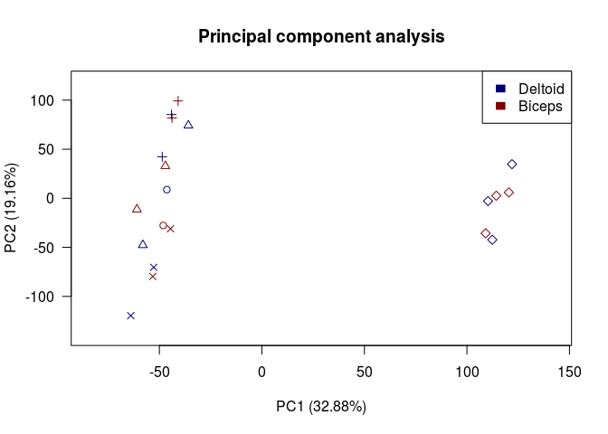
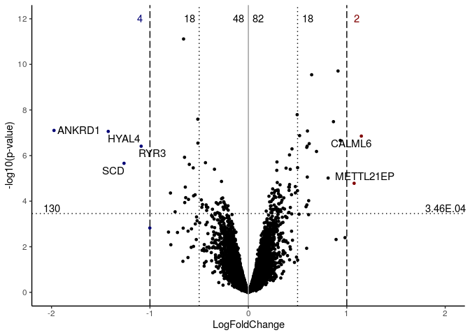

1.  Differential expression analysis (DEA)
================

``` r
suppressPackageStartupMessages ({
  library (knitr)
  library (limma)
  library (edgeR)
  library (ggplot2)
  library (gProfileR)
  library (biomaRt)
  library (ggrepel)
  library (dplyr)
})
opts_knit$set (root.dir = rprojroot::find_rstudio_root_file())
opts_chunk$set (eval = TRUE, tidy = TRUE, highlight = TRUE, fig.path = "../Figures/")
BiocStyle::markdown ()
```

Loading expression and phenotypic data
--------------------------------------

``` r
load("Outputs/HealthyMusclesDataforDEA.RData")
cols <- c("gender", "muscle", "batch")
phen[cols] <- lapply(phen[cols], factor)
```

Principal component analysis
----------------------------

``` r
PC <- prcomp(scale(datasetFilt_control), center = FALSE, scale. = FALSE)
percent <- 100 * PC$sdev^2/sum(PC$sdev^2)
# Batch x muscle:
PCH <- c(1:length(unique(phen$batch)))[as.integer(factor(phen$batch, levels = c(unique(phen$batch))))]
COL <- c("#000075", "#800000")[as.integer(factor(phen$muscle, levels = c("Deltoid", 
    "Biceps")))]
plot(PC$x[, "PC1"], PC$x[, "PC2"], xlab = paste0("PC1 (", round(percent[1], 2), "%)"), 
    ylab = paste0("PC2 (", round(percent[2], 2), "%)"), pch = PCH, lwd = 1, col = COL, 
    las = 1, xlim = c(min(PC$x[, "PC1"]) - 20, max(PC$x[, "PC1"]) + 20), ylim = c(min(PC$x[, 
        "PC2"]) - 20, max(PC$x[, "PC2"]) + 20))
title("Principal component analysis")
legend("topright", legend = c("Deltoid", "Biceps"), fill = c("#000075", "#800000"), 
    border = "white")
```



DEA
---

``` r
## Prepararing design matrix
design <- model.matrix(~0 + phen$muscle + phen$gender)
colnames(design) <- gsub("[[:punct:]]|phen", "", colnames(design))
rownames(design) <- rownames(phen)
corfit <- duplicateCorrelation(t(datasetFilt_control), design, block = phen$cohort)
fit <- lmFit(t(datasetFilt_control), design, block = phen$cohort, correlation = corfit$consensus)
cm <- makeContrasts(contrast = muscleBiceps - muscleDeltoid, levels = design)
colnames(cm) <- "MuscleDeltoid_Vs_MuscleBiceps"
fit2 <- contrasts.fit(fit, cm)
fit2 <- eBayes(fit2)

# DE results
DE_results <- topTable(fit2, n = Inf, coef = colnames(cm))
DE_results$DE <- factor((DE_results$adj.P.Val <= 0.05) * sign(as.numeric(DE_results$logFC)), 
    levels = c(-1, 0, 1))
save(DE_results, file = "Outputs/DEA.RData")
```

### volcano plot

``` r
xlim <- c(-max(abs(pretty(DE_results$logFC))), max(abs(pretty(DE_results$logFC))))
ylim <- c(0, max(pretty(-log10(DE_results$P.Value))))
text <- rownames(subset(DE_results, abs(logFC) > 1 & DE != 0))


Volcano <- ggplot(DE_results, aes(x = logFC, y = -log10(P.Value))) + geom_point(size = 1, 
    aes(colour = cut(logFC, c(-2, -1, 1, 2)))) + theme_classic() + scale_x_continuous(limits = xlim) + 
    scale_y_continuous(limits = ylim, breaks = seq(0, 12, 2)) + geom_vline(xintercept = c(-1, 
    1), linetype = "longdash", color = "black") + geom_vline(xintercept = c(-0.5, 
    0.5), linetype = "dotted", color = "black") + geom_vline(xintercept = 0, linetype = "solid", 
    color = "grey60") + geom_hline(yintercept = -log10(0.00035), linetype = "dotted", 
    color = "black") + scale_color_manual(values = c(`(-2,-1]` = "#000075", `(-1,1]` = "black", 
    `(1,2]` = "#800000")) + guides(colour = FALSE) + labs(x = "LogFoldChange", y = "-log10(p-value)") + 
    geom_text_repel(data = subset(DE_results, abs(logFC) > 1 & DE != 0), aes(label = text), 
        size = 4) + annotate("text", x = c(-1.1, -0.6, -0.1, 0.1, 0.6, 1.1), y = 12, 
    label = c(nrow(DE_results %>% filter(DE != 0) %>% filter(logFC <= -1)), nrow(DE_results %>% 
        filter(DE != 0) %>% filter(logFC <= -0.5)), nrow(DE_results %>% filter(DE != 
        0) %>% filter(logFC < 0)), nrow(DE_results %>% filter(DE != 0) %>% filter(logFC > 
        0)), nrow(DE_results %>% filter(DE != 0) %>% filter(logFC > 0.5)), nrow(DE_results %>% 
        filter(DE != 0) %>% filter(logFC > 1))), colour = c("#000075", rep("black", 
        4), "#800000")) + annotate("text", x = c(-2, 2), y = 3.7, label = c(nrow(DE_results %>% 
    filter(DE != 0)), "3.46E.04"))
Volcano
```



Enrichment analysis
-------------------

``` r
human <- useMart("ensembl", dataset = "hsapiens_gene_ensembl", host = "http://Apr2018.archive.ensembl.org")
annot_ens92 <- getBM(attributes = c("ensembl_gene_id", "external_gene_name"), mart = human)
human <- useMart("ensembl", dataset = "hsapiens_gene_ensembl", host = "http://Jul2018.archive.ensembl.org")
annot_ens93 <- getBM(attributes = c("ensembl_gene_id", "external_gene_name"), mart = human)
Annot_ENS_GeneNames <- merge(annot_ens93, annot_ens92, all = T) %>% filter(external_gene_name %in% 
    c(gsub("___.*", "", rownames(DE_results)), gsub("\\.", "-", gsub("___.*", "", 
        rownames(DE_results)))))

Gene_list <- unique(gsub("___.*", "", (rownames(DE_results)[DE_results$DE != 0])))
Annot_ENS_subset <- unique(Annot_ENS_GeneNames[Annot_ENS_GeneNames$external_gene_name %in% 
    c(Gene_list, gsub("\\.", "-", Gene_list)), 1])
BG <- unique(as.vector(Annot_ENS_GeneNames$ensembl_gene_id))
GP <- gprofiler(Annot_ENS_subset, organism = "hsapiens", domain_size = "known", custom_bg = BG, 
    correction_method = "fdr")
dim(GP %>% filter(!domain %in% c("cor", "tf")))
```

    ## [1]  0 14

``` r
sessionInfo()
```

    ## R version 3.2.3 (2015-12-10)
    ## Platform: x86_64-pc-linux-gnu (64-bit)
    ## Running under: Ubuntu 16.04.5 LTS
    ## 
    ## locale:
    ##  [1] LC_CTYPE=en_US.UTF-8       LC_NUMERIC=C              
    ##  [3] LC_TIME=en_US.UTF-8        LC_COLLATE=en_US.UTF-8    
    ##  [5] LC_MONETARY=en_US.UTF-8    LC_MESSAGES=en_US.UTF-8   
    ##  [7] LC_PAPER=en_US.UTF-8       LC_NAME=C                 
    ##  [9] LC_ADDRESS=C               LC_TELEPHONE=C            
    ## [11] LC_MEASUREMENT=en_US.UTF-8 LC_IDENTIFICATION=C       
    ## 
    ## attached base packages:
    ## [1] stats     graphics  grDevices utils     datasets  methods   base     
    ## 
    ## other attached packages:
    ## [1] BiocStyle_1.8.0 ggrepel_0.8.1   ggplot2_3.2.1   edgeR_3.12.1   
    ## [5] limma_3.26.9    knitr_1.27      gProfileR_0.7.0 biomaRt_2.37.4
    ## 
    ## loaded via a namespace (and not attached):
    ##  [1] Rcpp_1.0.3       formatR_1.7      pillar_1.4.2     tools_3.2.3     
    ##  [5] statmod_1.4.32   digest_0.6.23    evaluate_0.14    lifecycle_0.1.0 
    ##  [9] tibble_2.1.3     gtable_0.3.0     pkgconfig_2.0.3  rlang_0.4.2     
    ## [13] rstudioapi_0.10  yaml_2.2.0       xfun_0.12        withr_2.1.2     
    ## [17] stringr_1.4.0    dplyr_0.8.3      rprojroot_1.3-2  grid_3.2.3      
    ## [21] tidyselect_0.2.5 glue_1.3.1       R6_2.4.1         rmarkdown_2.0.7 
    ## [25] farver_2.0.1     purrr_0.3.3      magrittr_1.5     scales_1.1.0    
    ## [29] backports_1.1.5  htmltools_0.4.0  assertthat_0.2.1 colorspace_1.4-1
    ## [33] labeling_0.3     stringi_1.4.5    lazyeval_0.2.2   munsell_0.5.0   
    ## [37] crayon_1.3.4
