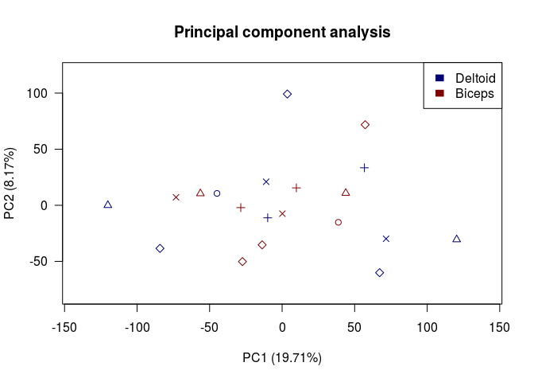

1.  Weighted gene co-expression network analysis (WGCNA)
================

``` r
suppressPackageStartupMessages ({
  library (knitr)

})
opts_knit$set (root.dir = rprojroot::find_rstudio_root_file())
opts_chunk$set (eval = TRUE, tidy = TRUE, highlight = TRUE, fig.path = "../Figures/")
BiocStyle::markdown ()
```

Loading expression and phenotypic data
--------------------------------------

``` r
load("Outputs/HealthyMusclesDataforWGCNA.RData")
```

Principal component analysis
----------------------------

``` r
PC <- prcomp(scale(resid_datasetFilt_control), center = FALSE, scale. = FALSE)
percent <- 100 * PC$sdev^2/sum(PC$sdev^2)
# Batch x muscle:
PCH <- c(1:length(unique(phenWGCNA$batch)))[as.integer(factor(phenWGCNA$batch, levels = c(unique(phenWGCNA$batch))))]
COL <- c("#000075", "#800000")[as.integer(factor(phenWGCNA$muscle, levels = c("0", 
    "1")))]
plot(PC$x[, "PC1"], PC$x[, "PC2"], xlab = paste0("PC1 (", round(percent[1], 2), "%)"), 
    ylab = paste0("PC2 (", round(percent[2], 2), "%)"), pch = PCH, lwd = 1, col = COL, 
    las = 1, xlim = c(min(PC$x[, "PC1"]) - 20, max(PC$x[, "PC1"]) + 20), ylim = c(min(PC$x[, 
        "PC2"]) - 20, max(PC$x[, "PC2"]) + 20))
title("Principal component analysis")
legend("topright", legend = c("Deltoid", "Biceps"), fill = c("#000075", "#800000"), 
    border = "white")
```



``` r
sessionInfo()
```

    ## R version 3.2.3 (2015-12-10)
    ## Platform: x86_64-pc-linux-gnu (64-bit)
    ## Running under: Ubuntu 16.04.5 LTS
    ## 
    ## locale:
    ##  [1] LC_CTYPE=en_US.UTF-8       LC_NUMERIC=C              
    ##  [3] LC_TIME=en_US.UTF-8        LC_COLLATE=en_US.UTF-8    
    ##  [5] LC_MONETARY=en_US.UTF-8    LC_MESSAGES=en_US.UTF-8   
    ##  [7] LC_PAPER=en_US.UTF-8       LC_NAME=C                 
    ##  [9] LC_ADDRESS=C               LC_TELEPHONE=C            
    ## [11] LC_MEASUREMENT=en_US.UTF-8 LC_IDENTIFICATION=C       
    ## 
    ## attached base packages:
    ## [1] stats     graphics  grDevices utils     datasets  methods   base     
    ## 
    ## other attached packages:
    ## [1] BiocStyle_1.8.0 knitr_1.27     
    ## 
    ## loaded via a namespace (and not attached):
    ##  [1] backports_1.1.5 magrittr_1.5    rprojroot_1.3-2 formatR_1.7    
    ##  [5] tools_3.2.3     htmltools_0.4.0 yaml_2.2.0      Rcpp_1.0.3     
    ##  [9] stringi_1.4.5   rmarkdown_2.0.7 stringr_1.4.0   xfun_0.12      
    ## [13] digest_0.6.23   rlang_0.4.2     evaluate_0.14
