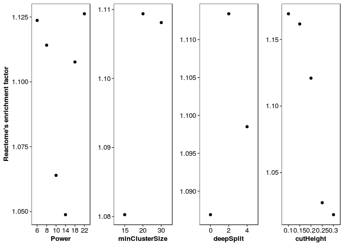
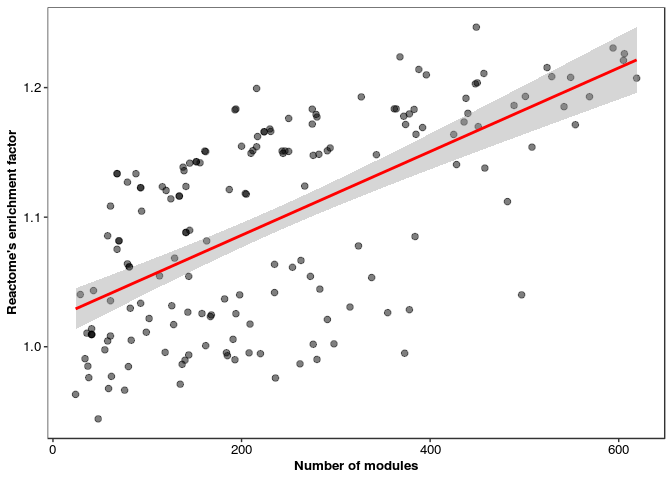
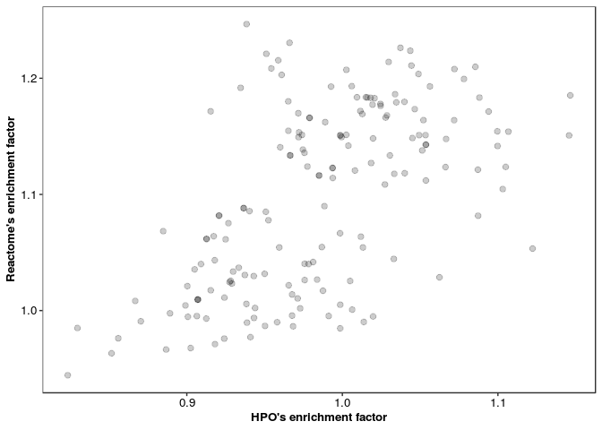

1.  Best WGCNA parameter setting, Co-expressed and Knowledge pairs overlaps
================

``` r
suppressPackageStartupMessages ({ 
  library (ggplot2)
  library (grid)
  library (knitr)
})
opts_knit$set (root.dir = rprojroot::find_rstudio_root_file())
opts_chunk$set (eval = TRUE, tidy = TRUE, highlight = TRUE, fig.path = "../Figures/")
BiocStyle::markdown ()
```

``` r
# WGCNA output for all settings
SettingsSummary <- read.csv ("Outputs/WGCNA_MergeModules/DifferentSettingsSummary.csv", as.is = T)
SettingsSummary$setting <- as.character (paste0 ("Power", SettingsSummary$Power,
                                                "MinModuleSize", SettingsSummary$MinModulesize,
                                                "deepSplit", SettingsSummary$deepSplit,
                                                "CutHeight", SettingsSummary$CutHeight))

# Knowldege databases (KD) Reactome or HPO
KDs <- c ("Reactome", "HPO")
for (KD in KDs) { 
  OverlapResults <- read.csv (paste0 ("Outputs/", 
                                         KD, "_OverlapResults.csv"), header = F)
  colnames (OverlapResults)  <- c ("setting", paste (c("No_Annotated_Coexpressed_genes",
                                                                "Ftest", 	"odds_ratio"), KD, sep = "_"))
  assign (paste0 (KD, "_OverlapResults"), OverlapResults)
}

OverlapResults <- merge (HPO_OverlapResults, Reactome_OverlapResults, by = "setting")
Setting <- merge (OverlapResults, SettingsSummary [, - c (6 : 11) ], by = "setting")


# The size of grey module
e <- new.env(); load("Outputs/WGCNA_MergeModules/AllGenesModules.RData", envir = e)
grey_size <- c ()
for (file in ls (e)) {
  x <- get (file, envir = e)
  grey_size [ file  ] <- length (unique (x [ x$V2 == "grey", 1 ]))
}
grey_size <- as.data.frame (grey_size)

# The final setting table
Setting$setting <- gsub ("Module", "", Setting$setting)
Setting <- merge (Setting, grey_size, by.x = "setting", by.y = "row.names")
cols <- c ("deepSplit", "MinModulesize", "CutHeight", "Power")
Setting [ cols ] <- lapply (Setting [ cols ], as.character)
Setting$Power <- factor (Setting$Power, levels =  c ("6", "8", "10", "14", "18", "22"))

head (Setting, 1)
```

    ##                                        setting
    ## 1 Power10MinModuleSize15deepSplit0CutHeight0.1
    ##   No_Annotated_Coexpressed_genes_HPO    Ftest_HPO odds_ratio_HPO
    ## 1                               3178 0.0001090896       0.936555
    ##   No_Annotated_Coexpressed_genes_Reactome Ftest_Reactome odds_ratio_Reactome
    ## 1                                    8433   1.438918e-94            1.088174
    ##   Power MinModulesize deepSplit CutHeight NoModules grey_size
    ## 1    10            15         0       0.1       141       145

``` r
p1 <- ggplot(Setting) + stat_summary(mapping = aes(x = Power, y = odds_ratio_Reactome), 
    geom = "point", fun.y = "median") + labs(x = "Power", y = "Reactome's enrichment factor") + 
    theme_bw() + theme(axis.text = element_text(size = 10, colour = "black"), axis.title = element_text(size = 10, 
    face = "bold"), panel.grid = element_blank())

p2 <- ggplot(Setting) + stat_summary(mapping = aes(x = MinModulesize, y = odds_ratio_Reactome), 
    geom = "point", fun.y = "median") + labs(x = "minClusterSize") + theme_bw() + 
    theme(axis.text = element_text(size = 10, colour = "black"), axis.title = element_text(size = 10, 
        face = "bold"), axis.title.y = element_blank(), panel.grid = element_blank())

p3 <- ggplot(Setting) + stat_summary(mapping = aes(x = deepSplit, y = odds_ratio_Reactome), 
    geom = "point", fun.y = "median") + labs(x = "deepSplit") + theme_bw() + theme(axis.text = element_text(size = 10, 
    colour = "black"), axis.title = element_text(size = 10, face = "bold"), axis.title.y = element_blank(), 
    panel.grid = element_blank())

p4 <- ggplot(Setting) + stat_summary(mapping = aes(x = CutHeight, y = odds_ratio_Reactome), 
    geom = "point", fun.y = "median") + labs(x = "cutHeight") + theme_bw() + theme(axis.text = element_text(size = 10, 
    colour = "black"), axis.title = element_text(size = 10, face = "bold"), axis.title.y = element_blank(), 
    panel.grid = element_blank())

grid.newpage()
grid.draw(cbind(ggplotGrob(p1), ggplotGrob(p2), ggplotGrob(p3), ggplotGrob(p4), size = "first"))
```



``` r
SettingSubset <- Setting[Setting$grey_size/18217 < 0.3, ]
lim <- c(min(SettingSubset$odds_ratio_HPO, SettingSubset$odds_ratio_Reactome), max(SettingSubset$odds_ratio_HPO, 
    SettingSubset$odds_ratio_Reactome))

ggplot(SettingSubset, aes(x = NoModules, y = odds_ratio_Reactome)) + geom_point(size = 2, 
    alpha = 0.5) + stat_smooth(method = "lm", col = "red") + theme_bw() + labs(x = "Number of modules", 
    y = "Reactome's enrichment factor") + theme(axis.text = element_text(size = 10, 
    colour = "black"), axis.title = element_text(size = 10, face = "bold"), title = element_text(size = 10, 
    colour = "black"), panel.grid = element_blank())
```



``` r
ggplot(SettingSubset, aes(x = odds_ratio_HPO, y = odds_ratio_Reactome)) + geom_point(size = 2, 
    alpha = 0.2) + labs(x = "HPO's enrichment factor", y = "Reactome's enrichment factor") + 
    theme_bw() + theme(axis.text = element_text(size = 10, colour = "black"), axis.title = element_text(size = 10, 
    face = "bold"), title = element_text(size = 10, colour = "black"), panel.grid = element_blank())
```



``` r
# Selected setting
SettingSubset[which.max(SettingSubset$odds_ratio_Reactome), ]
```

    ##                                         setting
    ## 233 Power8MinModuleSize15deepSplit2CutHeight0.2
    ##     No_Annotated_Coexpressed_genes_HPO   Ftest_HPO odds_ratio_HPO
    ## 233                               3179 0.003586122      0.9384338
    ##     No_Annotated_Coexpressed_genes_Reactome Ftest_Reactome odds_ratio_Reactome
    ## 233                                    8496              0            1.246621
    ##     Power MinModulesize deepSplit CutHeight NoModules grey_size
    ## 233     8            15         2       0.2       449         0

``` r
sessionInfo()
```

    ## R version 3.2.3 (2015-12-10)
    ## Platform: x86_64-pc-linux-gnu (64-bit)
    ## Running under: Ubuntu 16.04.5 LTS
    ## 
    ## locale:
    ##  [1] LC_CTYPE=en_US.UTF-8       LC_NUMERIC=C              
    ##  [3] LC_TIME=en_US.UTF-8        LC_COLLATE=en_US.UTF-8    
    ##  [5] LC_MONETARY=en_US.UTF-8    LC_MESSAGES=en_US.UTF-8   
    ##  [7] LC_PAPER=en_US.UTF-8       LC_NAME=C                 
    ##  [9] LC_ADDRESS=C               LC_TELEPHONE=C            
    ## [11] LC_MEASUREMENT=en_US.UTF-8 LC_IDENTIFICATION=C       
    ## 
    ## attached base packages:
    ## [1] grid      stats     graphics  grDevices utils     datasets  methods  
    ## [8] base     
    ## 
    ## other attached packages:
    ## [1] BiocStyle_1.8.0 knitr_1.27      ggplot2_3.2.1  
    ## 
    ## loaded via a namespace (and not attached):
    ##  [1] Rcpp_1.0.3       pillar_1.4.2     formatR_1.7      tools_3.2.3     
    ##  [5] digest_0.6.23    evaluate_0.14    lifecycle_0.1.0  tibble_2.1.3    
    ##  [9] gtable_0.3.0     pkgconfig_2.0.3  rlang_0.4.2      rstudioapi_0.10 
    ## [13] yaml_2.2.0       xfun_0.12        withr_2.1.2      dplyr_0.8.3     
    ## [17] stringr_1.4.0    rprojroot_1.3-2  tidyselect_0.2.5 glue_1.3.1      
    ## [21] R6_2.4.1         rmarkdown_2.0.7  farver_2.0.1     purrr_0.3.3     
    ## [25] magrittr_1.5     scales_1.1.0     backports_1.1.5  htmltools_0.4.0 
    ## [29] assertthat_0.2.1 colorspace_1.4-1 labeling_0.3     stringi_1.4.5   
    ## [33] lazyeval_0.2.2   munsell_0.5.0    crayon_1.3.4
