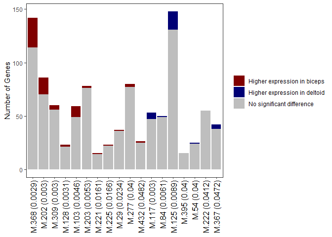

1.  Module-trait association
================

``` r
suppressPackageStartupMessages ({ 
  library (knitr)
  library (dplyr)
  library (nlme) 
  library (reshape2)
  library (ggplot2)
  library (gProfileR) 
  library (plyr) 
  library (biomaRt) 
  library (limma) })
opts_knit$set (root.dir = rprojroot::find_rstudio_root_file())
opts_chunk$set (eval = TRUE, tidy = TRUE, highlight = TRUE, fig.path = "../Figures/")
BiocStyle::markdown ()
```

Data reading
------------

``` r
load("Outputs/HealthyMusclesDataforWGCNA.RData")
load("Outputs/DEA.RData")
# WGCNA results of selected setting (Power8MinModuleSize15deepSplit2CutHeight0.2)
load("Outputs/WGCNAResultsCandidateSetting")

# Sample informations
phenWGCNA <- transform(phenWGCNA, individual = match(subject, unique(subject)))
phenWGCNA <- phenWGCNA[, c(4, 7, 6, 9)]

# Module eigengene (ME) vector (selected setting)
rownames(mergedMEs) <- rownames(resid_datasetFilt_control)

## Rename modules (colors to numbers)
Module_rename <- data.frame(Module = sort(gsub("ME", "", colnames(mergedMEs))), Rename = paste("M", 
    seq.int(length(colnames(mergedMEs))), sep = "."))
colnames(mergedMEs) <- Module_rename$Rename[match(gsub("ME", "", colnames(mergedMEs)), 
    Module_rename$Module)]

# Gene modules (selected setting)
All_gene_modules$V2 <- Module_rename$Rename[match(All_gene_modules$V2, Module_rename$Module)]
Module_sizes <- as.data.frame(table(All_gene_modules$V2))

# Final table with sample informations and module eigengene
complete_info <- merge(phenWGCNA, mergedMEs, by = "row.names")
complete_info <- complete_info %>% mutate(individual = as.factor(individual)) %>% 
    mutate(muscle = as.factor(ifelse(muscle == 1, "Biceps", "Deltoid"))) %>% mutate(gender = as.factor(gender)) %>% 
    mutate(age = as.integer(age))
```

Considering muscle and age as fix effects in a single model (individuals were considered as random effect)
----------------------------------------------------------------------------------------------------------

#### lme (Module\_eigengene\_vector ~ muscle + age, random=~1|individual, data)

``` r
Module_list <- colnames(complete_info)[grep("M.", colnames(complete_info))]
Module_trait_pval <- list()
for (i in 1:length(grep("M.", colnames(complete_info)))) {
    fml <- as.formula(paste(noquote(Module_list[i]), "~ muscle + age"))
    Module_trait_pval[Module_list[i]] <- data.frame(summary(lme(fml, random = ~1 | 
        individual, data = complete_info))$tTable[, "p-value"])
}
Module_trait_pval <- as.data.frame(do.call(rbind, Module_trait_pval))
colnames(Module_trait_pval) <- c("Intercept", "muscle", "age")
Module_trait_pval$muscle_adj <- p.adjust(Module_trait_pval$muscle, method = "fdr")
Module_trait_pval$age_adj <- p.adjust(Module_trait_pval$age, method = "fdr")
rownames(Module_trait_pval) <- paste0(Module_sizes$Var1, " (", Module_sizes$Freq, 
    ")")[match(noquote(rownames(Module_trait_pval)), Module_sizes$Var1)]
Module_name_size <- rownames(Module_trait_pval)
```

Significant modules
-------------------

``` r
Module_trait_pval <- as.data.frame(Module_trait_pval[apply(Module_trait_pval[, c(4, 
    5)], 1, function(x) any(x <= 0.05)), -c(1:3)])
par(mfrow = c(1, 1), cex = 1.5, mar = c(8, 8.5, 3, 3))
Module_trait_pval$module <- rownames(Module_trait_pval)
res <- reshape2::melt(Module_trait_pval)
res$variable <- ifelse(res$variable == "muscle_adj", "Muscle (FDR)", "Age (FDR)")

ggplot(res, aes(x = variable, y = module)) + geom_tile(aes(fill = value)) + scale_fill_gradientn(colours = c("white", 
    "red", "black"), values = scales::rescale(c(0, 0.05, 0.1, 0.5, 1))) + geom_text(aes(label = format(value, 
    digits = 2))) + ggtitle("Significant modules") + labs(x = NULL, y = NULL, fill = "FDR") + 
    theme(axis.text = element_text(size = 16), axis.title = element_text(size = 16, 
        face = "bold"))
```


``` r
Module_sig <- res[res$value < 0.05, ]
sig_modules <- Module_sig$module
complete_info <- complete_info[, c(1:5, which(colnames(complete_info) %in% gsub(" .*", 
    "", sig_modules)))]
All_modules_to_plot <- reshape2::melt(complete_info[-c(1, 3, 5)], id.vars = c("muscle", 
    "age"))
All_modules_to_plot$ind <- paste(All_modules_to_plot$muscle, All_modules_to_plot$age)
Module_order <- c("M.368", "M.202", "M.309", "M.128", "M.103", "M.203", "M.221", 
    "M.225", "M.29", "M.277", "M.432", "M.117", "M.84", "M.125", "M.395", "M.54", 
    "M.222", "M.367")
All_modules_to_plot$variable <- as.character(All_modules_to_plot$variable)
All_modules_to_plot <- All_modules_to_plot[order(match(All_modules_to_plot$variable, 
    Module_order)), ]
All_modules_to_plot$variable <- gsub(")", " genes)", sig_modules)[match(All_modules_to_plot$variable, 
    gsub(" .*", "", sig_modules))]
All_modules_to_plot$variable <- factor(All_modules_to_plot$variable, levels = unique(All_modules_to_plot$variable))

p <- ggplot(All_modules_to_plot, aes(variable, value, fill = muscle)) + geom_boxplot(alpha = 0.5) + 
    scale_fill_manual(values = c("#e6194B", "#4363d8")) + theme_bw() + labs(x = element_blank(), 
    y = "Module eigengene") + theme(axis.text = element_text(size = 12), axis.text.y = element_text(colour = rep(c("#e6194B", 
    "#4363d8"), c(11, 7)), hjust = 1), axis.title = element_text(size = 12, face = "bold"), 
    axis.ticks = element_blank(), plot.title = element_text(hjust = 0.5), panel.grid = element_blank(), 
    legend.title = element_blank())
p + geom_dotplot(binaxis = "y", stackdir = "center", position = position_dodge(1), 
    binwidth = 0.01) + geom_hline(yintercept = 0, linetype = "dashed", color = "grey") + 
    coord_flip()
```


``` r
All_gene_modules$V2 <- Module_name_size[match(All_gene_modules$V2, gsub(" .*", "", 
    Module_name_size))]
Module_gene_sig <- All_gene_modules[All_gene_modules$V2 %in% sig_modules, ]
colnames(Module_gene_sig) <- c("Gene", "Module")
rownames(DE_results) <- gsub("-", ".", rownames(DE_results))
DE_gene_module_sig <- merge(Module_gene_sig, DE_results[c(5, 7)], by.y = "row.names", 
    by.x = "Gene")
DE_gene_module_sig$DE_plot[DE_gene_module_sig$DE == 1] = "Higher expression in biceps"
DE_gene_module_sig$DE_plot[DE_gene_module_sig$DE == -1] = "Higher expression in deltoid"
DE_gene_module_sig$DE_plot[DE_gene_module_sig$DE == 0] = "No significant difference"
DE_gene_module_sig_plot <- ddply(DE_gene_module_sig[, c(2, 5)], .(DE_gene_module_sig$Module, 
    DE_gene_module_sig$DE_plot), nrow)
names(DE_gene_module_sig_plot) <- c("Module", "DE", "Freq")
values = c(`No significant difference` = "grey", `Higher expression in biceps` = "#800000", 
    `Higher expression in deltoid` = "#000075")
DE_gene_module_sig_plot$module <- paste0(gsub(" .*", "", Module_sig$module)[match(DE_gene_module_sig_plot$Module, 
    Module_sig$module)], " (", round(Module_sig$value[match(DE_gene_module_sig_plot$Module, 
    Module_sig$module)], 4), ")")
DE_gene_module_sig_plot <- DE_gene_module_sig_plot[order(match(gsub(" .*", "", DE_gene_module_sig_plot$Module), 
    Module_order), DE_gene_module_sig_plot$DE), ]
DE_gene_module_sig_plot$module <- factor(DE_gene_module_sig_plot$module, levels = unique(DE_gene_module_sig_plot$module))

ggplot(DE_gene_module_sig_plot, aes(module, Freq, fill = DE)) + geom_bar(stat = "identity") + 
    theme_bw() + scale_fill_manual(values = values) + theme(axis.text.x = element_text(angle = 90, 
    colour = "black", size = 12, hjust = 1, vjust = 0.5), axis.title.x = element_blank(), 
    legend.title = element_blank(), panel.grid = element_blank()) + labs(y = "Number of Genes")
```



Enrichment analysis
-------------------

``` r
human <- useMart("ensembl", dataset = "hsapiens_gene_ensembl", host = "http://Apr2018.archive.ensembl.org")
annot_ens92 <- getBM(attributes = c("ensembl_gene_id", "external_gene_name"), mart = human)
human <- useMart("ensembl", dataset = "hsapiens_gene_ensembl", host = "http://Jul2018.archive.ensembl.org")
annot_ens93 <- getBM(attributes = c("ensembl_gene_id", "external_gene_name"), mart = human)
Annot_ENS_GeneNames <- merge(annot_ens93, annot_ens92, all = T) %>% filter(external_gene_name %in% 
    c(gsub("___.*", "", rownames(DE_results)), gsub("\\.", "-", gsub("___.*", "", 
        rownames(DE_results)))))

for (module in unique(DE_gene_module_sig$Module)) {
    Gene_list <- gsub("___.*", "", (unique(as.vector(DE_gene_module_sig[DE_gene_module_sig$Module == 
        module, 1]))))
    Annot_ENS_subset <- unique(Annot_ENS_GeneNames[Annot_ENS_GeneNames$external_gene_name %in% 
        c(Gene_list, gsub("\\.", "-", Gene_list)), 1])
    BG <- unique(as.vector(Annot_ENS_GeneNames$ensembl_gene_id))
    GP <- gprofiler(Annot_ENS_subset, organism = "hsapiens", domain_size = "known", 
        custom_bg = BG, correction_method = "fdr")
    if (dim(GP)[1] > 0) {
        GP$Module <- module
        assign(paste("GP", module, sep = "_"), GP)
    }
}

# The final table
GP_all_sig_modules <- do.call(rbind, lapply(ls(patt = "GP_"), get))
GP_all_sig_modules$query.number <- NULL
dim(GP_all_sig_modules)
```

    ## [1] 878  14

``` r
rm(list = setdiff(ls(pattern = "GP"), "GP_all_sig_modules"))
## Gene mapping
Gene_Symbols <- list()
for (i in 1:nrow(GP_all_sig_modules)) {
    ENS <- GP_all_sig_modules[i, "intersection"]
    ENS <- unique(unlist(strsplit(as.character(ENS), split = ",")))
    Gene_Symbol <- c()
    for (j in ENS) {
        Gene_Symbol[j] <- Annot_ENS_GeneNames[Annot_ENS_GeneNames$ensembl_gene_id == 
            j, 2]
    }
    Gene_Symbols[[i]] <- paste(Gene_Symbol, collapse = ",")
}
Gene_Symbols <- do.call(rbind, Gene_Symbols)
GP_all_sig_modules <- cbind(GP_all_sig_modules, Gene_Symbols)
write.csv(GP_all_sig_modules, paste0("Outputs/EnrichmentResultsMuscleRelatedModules.csv"), 
    row.names = F)
```

``` r
sessionInfo()
```

    ## R version 3.2.3 (2015-12-10)
    ## Platform: x86_64-pc-linux-gnu (64-bit)
    ## Running under: Ubuntu 16.04.5 LTS
    ## 
    ## locale:
    ##  [1] LC_CTYPE=en_US.UTF-8       LC_NUMERIC=C              
    ##  [3] LC_TIME=en_US.UTF-8        LC_COLLATE=en_US.UTF-8    
    ##  [5] LC_MONETARY=en_US.UTF-8    LC_MESSAGES=en_US.UTF-8   
    ##  [7] LC_PAPER=en_US.UTF-8       LC_NAME=C                 
    ##  [9] LC_ADDRESS=C               LC_TELEPHONE=C            
    ## [11] LC_MEASUREMENT=en_US.UTF-8 LC_IDENTIFICATION=C       
    ## 
    ## attached base packages:
    ## [1] stats     graphics  grDevices utils     datasets  methods   base     
    ## 
    ## other attached packages:
    ##  [1] BiocStyle_1.8.0    limma_3.26.9       biomaRt_2.37.4     plyr_1.8.5          
    ##  [5] gProfileR_0.7.0    ggplot2_3.2.1      reshape2_1.4.3     nlme_3.1-131
    ##  [9] dplyr_0.8.3        knitr_1.27        
    ## 
    ## loaded via a namespace (and not attached):
    ##  [1] Rcpp_1.0.3         formatR_1.7        pillar_1.4.2       bitops_1.0-6      
    ##  [5] tools_3.2.3        digest_0.6.23      evaluate_0.14      tibble_2.1.3      
    ##  [9] lifecycle_0.1.0    gtable_0.3.0       lattice_0.20-38    pkgconfig_2.0.3   
    ## [13] rlang_0.4.2        rstudioapi_0.10    yaml_2.2.0         xfun_0.12         
    ## [17] withr_2.1.2        stringr_1.4.0      caTools_1.17.1.3   gtools_3.8.1      
    ## [21] rprojroot_1.3-2    grid_3.2.3         tidyselect_0.2.5   glue_1.3.1        
    ## [25] R6_2.4.1           rmarkdown_2.0.7    gdata_2.18.0       farver_2.0.1      
    ## [29] purrr_0.3.3        magrittr_1.5       backports_1.1.5    scales_1.1.0      
    ## [33] htmltools_0.4.0    assertthat_0.2.1   colorspace_1.4-1   labeling_0.3      
    ## [37] KernSmooth_2.23-16 stringi_1.4.5      lazyeval_0.2.2     munsell_0.5.0     
    ## [41] crayon_1.3.4
