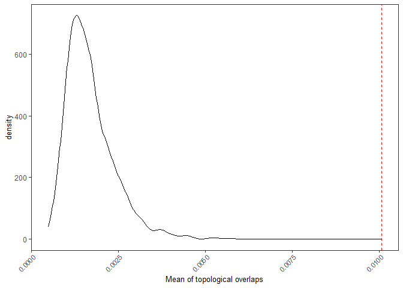

1.  Gene set connectivity
================

``` r
suppressPackageStartupMessages ({ 
  library (dplyr)
  library (reshape2)
  library (ggplot2)
  library (WGCNA)
  library (tibble)  
  library (knitr)
  })
opts_knit$set (root.dir = rprojroot::find_rstudio_root_file())
opts_chunk$set (eval = TRUE, tidy = TRUE, highlight = TRUE, fig.path = "../Figures/")
BiocStyle::markdown ()
```

Data reading
------------

``` r
load("Outputs/GenePathway_gProfileR.RData")  #Big file not provided!
load("Outputs/dissTOMPower8.RData")  #Big file not provided!
TOM <- 1 - dissTOM
rm(dissTOM)
load("Outputs/WGCNAResultsCandidateSetting")
Module_rename <- data.frame(Module = sort(unique(All_gene_modules$V2)), Rename = paste("M", 
    seq.int(length(unique(All_gene_modules$V2))), sep = "."))
All_gene_modules$V2 <- Module_rename$Rename[match(All_gene_modules$V2, Module_rename$Module)]

load("Outputs/HealthyMusclesDataforWGCNA.RData")
load("Outputs/DEA.RData")


# Sebsetting genes involved in TCA cycle and Respiratory electron transport
TCA <- unlist(strsplit(as.character(GenePathway %>% filter(term.name == "Citric acid cycle (TCA cycle)") %>% 
    .$Gene_Symbols), ","))
ETC <- unlist(strsplit(as.character(GenePathway %>% filter(term.name == "Respiratory electron transport") %>% 
    .$Gene_Symbols), ","))
AerobicGenes <- unique(c(TCA, ETC))

# Myofiber genes Based on Smith et al, 2013
fast <- c("MYH1", "MYH2", "MYL1", "MYBPS2", "TNNT3", "TNNI2", "TNNC2", "TPM1", "TMOD4", 
    "ATP2A1", "CASQ1")
slow <- c("MYH7", "MYL2", "MYL3", "MYBL2", "TNNT1", "TNNI1", "TNNC1", "TPM3", "TMOD1", 
    "ATP2A2", "CASQ2")

# Muscle related modules
HigherInBiceps <- c("M.368", "M.202", "M.309", "M.128", "M.103", "M.203", "M.221", 
    "M.225", "M.29", "M.277", "M.432")
HigherInDeltoied <- c("M.117", "M.84", "M.125", "M.395", "M.54", "M.222", "M.367")

All_gene_modules$MuscleRelated <- ifelse(All_gene_modules$V2 %in% HigherInBiceps, 
    "HigherInBiceps", ifelse(All_gene_modules$V2 %in% HigherInDeltoied, "HigherInDeltoied", 
        ""))
All_gene_modules$Pathway <- ifelse(All_gene_modules$V1 %in% ETC, "ETC", ifelse(All_gene_modules$V1 %in% 
    TCA, "TCA", ""))
```

1.  The connectivity of genes involved in aerobic metabolism

``` r
# TOM subset
TOM_subset <- TOM[gsub("___.*", "", rownames(TOM)) %in% AerobicGenes, gsub("___.*", 
    "", colnames(TOM)) %in% AerobicGenes]

# Save an input for Cytoscape
Cytoscape_TOM_subset <- exportNetworkToCytoscape(TOM_subset, edgeFile = "Outputs/CytoscapeInput-TOM-edges_AerobicMetabolism.txt", 
    nodeFile = "Outputs/CytoscapeInput-TOM-nodes_AerobicMetabolism.txt", weighted = TRUE, 
    threshold = 0, altNodeNames = All_gene_modules %>% filter(V1 %in% AerobicGenes) %>% 
        .$V2, nodeAttr = All_gene_modules %>% filter(V1 %in% AerobicGenes) %>% .$Pathway)

mean(AM_subnetwork_TOM <- TOM_subset %>% melt %>% filter(Var1 != Var2) %>% .$value)  ## 0.007831119
```

    ## [1] 0.007831119

``` r
# 1000 Random subnetworks (with same number of nodes (98 genes))
set.seed(123)
Genes <- All_gene_modules %>% .$V1
TOM_random_subsets <- replicate(1000, {
    subset <- sample(Genes, length(AerobicGenes))
    TOM_subset <- TOM[subset, subset]
    TOM_subset %>% melt %>% filter(Var1 != Var2) %>% .$value
})
TOM_random_subsets_colMean <- data.frame(ColMean = colMeans(TOM_random_subsets))
ggplot(TOM_random_subsets_colMean, aes(ColMean)) + geom_density() + theme_bw() + 
    labs(x = "Mean of topological overlaps") + geom_vline(xintercept = mean(AM_subnetwork_TOM), 
    linetype = "dashed", color = "red") + theme(panel.grid = element_blank(), axis.title = element_text(size = 10), 
    axis.text.x = element_text(angle = 45, hjust = 1, size = 8))
```


``` r
# x0 = observed value = `mean (AM_subnetwork_TOM)`.  N = #random sampling = 1000
# x = mean for each subsample = `TOM_random_subsets_colMean`, pval = sum(x >=
# x0)/N
(pval = sum(TOM_random_subsets_colMean >= mean(AM_subnetwork_TOM))/1000)
```

    ## [1] 0

``` r
# correct for finite sampling bias: pval = (1+sum(x >= x0))/(N+1)
(pval = (1 + sum(TOM_random_subsets_colMean >= mean(AM_subnetwork_TOM)))/(1000 + 
    1))
```

    ## [1] 0.000999001

``` r
# if N is large the two values will be very close.

# Expression of the aerobic genes
AerobicSubset <- resid_datasetFilt_control[, gsub("___.*", "", colnames(resid_datasetFilt_control)) %in% 
    AerobicGenes]
rownames(AerobicSubset) <- ifelse(phenWGCNA$muscle == 0, "Deltoid", "Biceps")[match(rownames(AerobicSubset), 
    phenWGCNA$sampID)]
AerobicSubset_DE <- DE_results[rownames(DE_results) %in% colnames(AerobicSubset), 
    ]["logFC"]
AerobicSubset <- melt(data.matrix(AerobicSubset))
AerobicSubset <- merge(AerobicSubset, AerobicSubset_DE, by.x = "Var2", by.y = "row.names")
AerobicSubset$Pathway <- ifelse(gsub("-.*", "", AerobicSubset$Var2) %in% TCA, "TCA cycle", 
    "Respiratory electron transport")

ggplot(AerobicSubset, aes(x = reorder(Var2, -abs(logFC)), y = value, fill = Var1)) + 
    geom_boxplot(alpha = 0.5) + scale_fill_manual(values = c("#4363d8", "#e6194B")) + 
    theme_bw() + facet_grid(~Pathway, scales = "free", space = "free_x") + theme(panel.grid = element_blank(), 
    axis.text.x = element_text(angle = 90, size = 8, vjust = 0.5, hjust = 1), axis.ticks = element_blank(), 
    legend.text = element_text(size = 8, vjust = 0.5), strip.text = element_text(size = 12, 
        face = "bold")) + labs(y = "Normalized expression", x = element_blank(), 
    fill = element_blank())
```


1.  The connectivity of fast-twitch and slow-twitch genes

``` r
# TOM subset
TOM_subset <- TOM[gsub("___.*", "", rownames(TOM)) %in% c(slow, fast), gsub("___.*", 
    "", colnames(TOM)) %in% c(slow, fast)]

# Save an input for Cytoscape
Cytoscape_TOM_subset <- exportNetworkToCytoscape(TOM_subset, edgeFile = "Outputs/CytoscapeInput-TOM-edges_MyofiberType.txt", 
    nodeFile = "Outputs/CytoscapeInput-TOM-nodes-MyofiberType.txt", weighted = TRUE, 
    threshold = 0, altNodeNames = All_gene_modules %>% filter(V1 %in% c(slow, fast)) %>% 
        .$V2, nodeAttr = ifelse(rownames(TOM_subset) %in% slow, "slow twitch", "fast twitch"))

mean(MF_subnetwork_TOM <- TOM_subset %>% melt %>% filter(Var1 != Var2) %>% .$value)  ## 0.0100694
```

    ## [1] 0.0100694

``` r
# 1000 Random subnetworks (with same number of nodes (19 genes))
set.seed(123)
TOM_random_subsets <- replicate(1000, {
    subset <- sample(Genes, dim(TOM_subset)[1])
    TOM_subset <- TOM[subset, subset]
    TOM_subset %>% melt %>% filter(Var1 != Var2) %>% .$value
})
TOM_random_subsets_colMean <- data.frame(ColMean = colMeans(TOM_random_subsets))
ggplot(TOM_random_subsets_colMean, aes(ColMean)) + geom_density() + theme_bw() + 
    labs(x = "Mean of topological overlaps") + geom_vline(xintercept = mean(MF_subnetwork_TOM), 
    linetype = "dashed", color = "red") + theme(panel.grid = element_blank(), axis.title = element_text(size = 10), 
    axis.text.x = element_text(angle = 45, hjust = 1, size = 8))
```



``` r
# x0 = observed value = `mean (MF_subnetwork_TOM)`.  N = #random sampling = 1000
# x = mean for each subsample = `TOM_random_subsets_colMean`, pval = sum(x >=
# x0)/N
(pval = sum(TOM_random_subsets_colMean >= mean(MF_subnetwork_TOM))/1000)
```

    ## [1] 0

``` r
# correct for finite sampling bias: pval = (1+sum(x >= x0))/(N+1)
(pval = (1 + sum(TOM_random_subsets_colMean >= mean(MF_subnetwork_TOM)))/(1000 + 
    1))
```

    ## [1] 0.000999001

``` r
# if N is large the two values will be very close.

# Expression of myofiber type genes
MyofiberTypeSubset <- resid_datasetFilt_control[, gsub("___.*", "", colnames(resid_datasetFilt_control)) %in% 
    c(fast, slow)]
rownames(MyofiberTypeSubset) <- ifelse(phenWGCNA$muscle == 0, "Deltoid", "Biceps")[match(rownames(MyofiberTypeSubset), 
    phenWGCNA$sampID)]
MyofiberTypeSubset_DE <- DE_results[rownames(DE_results) %in% colnames(MyofiberTypeSubset), 
    ]["logFC"]
MyofiberTypeSubset <- melt(data.matrix(MyofiberTypeSubset))
MyofiberTypeSubset <- merge(MyofiberTypeSubset, MyofiberTypeSubset_DE, by.x = "Var2", 
    by.y = "row.names")
MyofiberTypeSubset$Type <- ifelse(MyofiberTypeSubset$Var2 %in% fast, "Fast-twitch", 
    "Slow-twitch")

ggplot(MyofiberTypeSubset, aes(x = reorder(Var2, -abs(logFC)), y = value, fill = Var1)) + 
    geom_boxplot(alpha = 0.5) + scale_fill_manual(values = c("#4363d8", "#e6194B")) + 
    theme_bw() + facet_grid(~Type, scales = "free", space = "free_x") + theme(panel.grid = element_blank(), 
    axis.text.x = element_text(angle = 90, size = 8, vjust = 0.5, hjust = 1), axis.ticks = element_blank(), 
    legend.text = element_text(size = 8, vjust = 0.5), strip.text = element_text(size = 12, 
        face = "bold")) + labs(y = "Normalized expression", x = element_blank(), 
    fill = element_blank())
```


